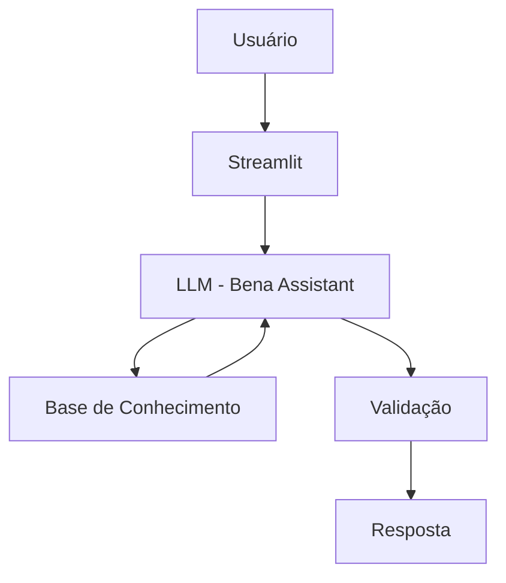

# 📊 Bena - FP&A Assistant

> Assistente virtual com Inteligência Artificial especializado em FP&A (Financial Planning & Analysis), planejamento financeiro, orçamento, forecast e indicadores de desempenho.

## 💡 O Que é a Bena?

A Bena é uma assistente virtual desenvolvida para apoiar estudantes, profissionais em transição de carreira e analistas iniciantes que desejam aprender conceitos de FP&A e Finanças Corporativas de forma prática e acessível.

Seu objetivo é explicar conceitos financeiros, auxiliar na interpretação de indicadores e apoiar o desenvolvimento de raciocínio analítico aplicado ao contexto corporativo.

### O que a Bena faz

- ✅ Explica conceitos de FP&A de forma simples e didática
- ✅ Auxilia no entendimento de Budget e Forecast
- ✅ Explica indicadores financeiros e de desempenho
- ✅ Utiliza exemplos práticos para facilitar o aprendizado
- ✅ Apoia o desenvolvimento de raciocínio analítico financeiro
- ✅ Responde dúvidas sobre planejamento financeiro corporativo

### O que a Bena NÃO faz

- ❌ Não toma decisões de negócio pelo usuário
- ❌ Não fornece aconselhamento financeiro, jurídico ou contábil
- ❌ Não substitui gestores, controllers ou especialistas financeiros
- ❌ Não inventa informações fora da base de conhecimento disponível

---

## 🏗️ Arquitetura



### Stack Utilizada

- Interface: Streamlit
- LLM Local: Ollama
- Modelo: Qwen 2.5 3B
- Linguagem: Python
- Base de Conhecimento: Arquivos JSON e CSV

---

## 📁 Estrutura do Projeto

```text
├── data/
│   ├── perfil_usuario.json
│   ├── indicadores_financeiros.csv
│   ├── historico_consultas.csv
│   └── conceitos_financeiros.json
│
├── docs/
│   ├── 01-documentacao-agente.md
│   ├── 02-base-conhecimento.md
│   ├── 03-prompts.md
│   ├── 04-metricas.md
│   └── 05-pitch.md
│
├── src/
│   └── app.py
│
└── README.md
```

---

## 🚀 Como Executar

### 1. Instalar o Ollama

Acesse:

https://ollama.com

Após a instalação:

```bash
ollama pull qwen2.5:3b
```

### 2. Instalar Dependências

```bash
pip install streamlit pandas requests
```

### 3. Executar a Aplicação

```bash
streamlit run src/app.py
```

---

## 🎯 Exemplos de Uso

### Exemplo 1

**Pergunta:**

```text
Qual a diferença entre Budget e Forecast?
```

**Resposta:**

```text
Budget é o plano financeiro definido antes do início do período, contendo metas de receita, custos e resultados.

Forecast é uma atualização dessas projeções com base nos resultados mais recentes e nas expectativas atuais do negócio.
```

---

### Exemplo 2

**Pergunta:**

```text
O que é EBITDA?
```

**Resposta:**

```text
EBITDA é um indicador utilizado para avaliar a geração operacional de resultados de uma empresa, desconsiderando juros, impostos, depreciação e amortização.
```

---

### Exemplo 3

**Pergunta:**

```text
Meu Forecast ficou abaixo do Budget. Isso é ruim?
```

**Resposta:**

```text
Não necessariamente. Isso indica que as expectativas atuais estão abaixo do planejado originalmente. O próximo passo é entender quais fatores causaram a diferença e quais ações podem ser tomadas.
```

---

## 📊 Métricas de Avaliação

| Métrica | Objetivo |
|----------|----------|
| Assertividade | O agente responde corretamente à pergunta realizada? |
| Clareza | A explicação é compreensível para o público-alvo? |
| Coerência | A resposta está alinhada ao contexto disponível? |
| Segurança | O agente evita inventar informações? |
| Relevância | A resposta permanece dentro do escopo de FP&A? |

---

## 🎬 Diferenciais

- 📊 Especialização em FP&A e Finanças Corporativas
- 🤖 Utilização de IA Generativa com LLM local
- 🔒 Execução local através do Ollama
- 📚 Base de conhecimento estruturada
- 🎯 Foco em aprendizado e desenvolvimento profissional
- 🚫 Estratégias de prevenção de alucinação documentadas

---

## 📝 Documentação

A documentação completa do projeto está disponível na pasta:

```text
/docs
```

Nela estão descritos:

- Caso de uso do agente
- Persona e comportamento
- Estratégia de base de conhecimento
- Prompts utilizados
- Métricas de avaliação
- Pitch do projeto

---

## 👩‍💻 Autora

**Beatriz Mendonça Simões**

Projeto desenvolvido como parte do desafio final de Python e Inteligência Artificial da DIO (Digital Innovation One).
